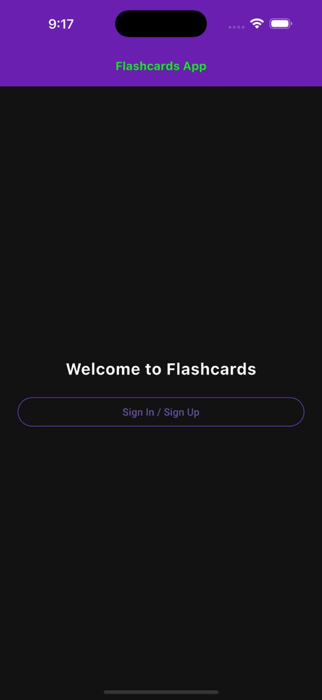
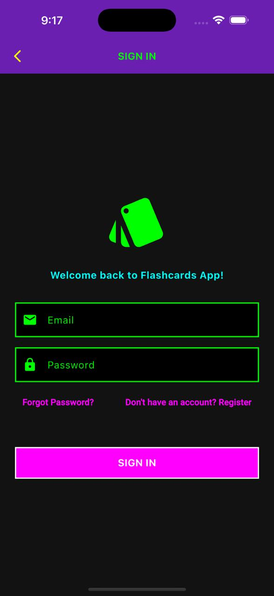
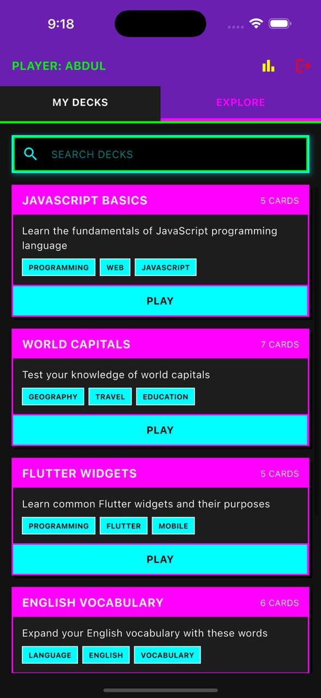
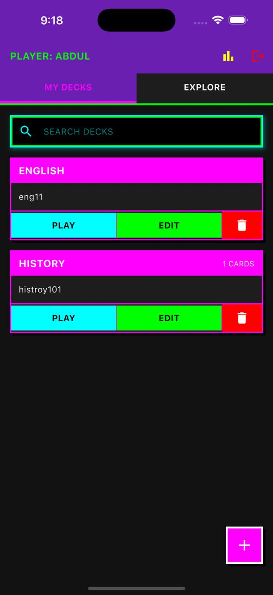
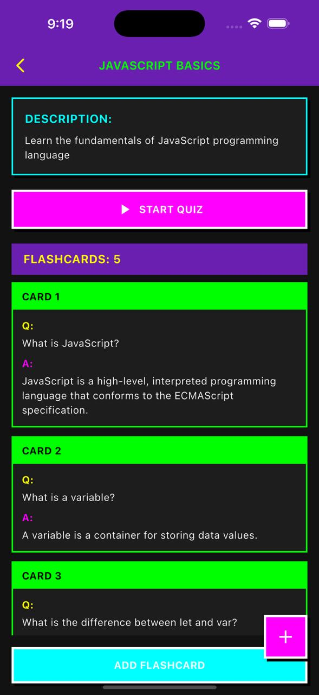
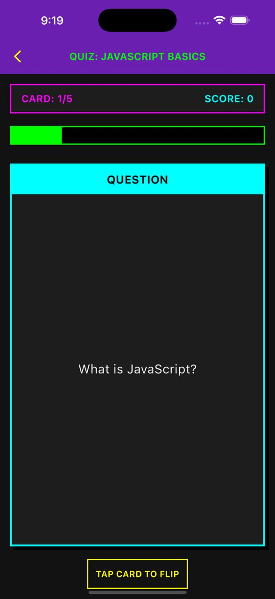
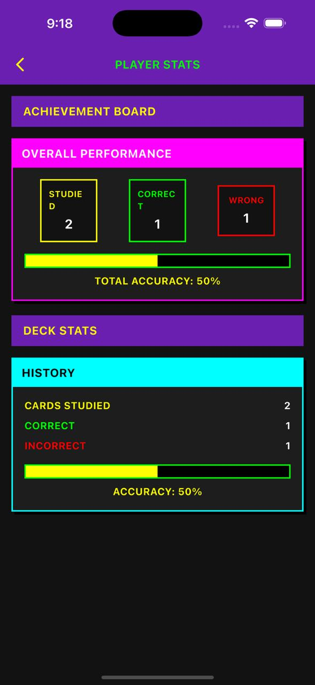
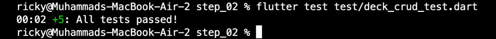

## Microlearning Flashcards App

**Group No:** 4  
**Team Members:**  
- Hamad Naseem  (2280143)
- Muhammad Bin Tariq  (2280150)
- Rehan Badshah  (2280159)

---

## App Description

The **Microlearning Flashcards App** is a modern learning tool built with Flutter for students who prefer bite-sized study sessions over long, exhausting methods. It supports spaced repetition, deck creation, quiz-based study, and progress tracking—all in a sleek, user-friendly interface.

---

## Features

- **User Authentication**: Sign up, log in, and log out securely using email.
- **Deck Management**: Create, edit, delete, and organize flashcards into decks.
- **Study Mode (Quiz)**: Review flashcards through an interactive quiz system.
- **Explore Public Decks**: Browse and search public decks by names.
- **Progress Tracking**: Visualize performance stats like quiz accuracy and deck progress.

---

## Technical Requirements
- Flutter for frontend UI (cross-platform)
- Firebase for authentication and real-time database (Firestore)
- BLoC Architecture for scalable and maintainable state management

---

## Screenshots

| Splash Screen                | Sign In / Sign Up                   |
|------------------------------|-------------------------------------|
| |  |

| Home Screen                  | Explore Page                        |
|------------------------------|-------------------------------------|
| |  |

| Deck Detail Page            | Quiz Interface                      |
|-----------------------------|-------------------------------------|
| |  |

| Progress Dashboard          | Test Output Screen                  |
|-----------------------------|-------------------------------------|
| |  |

---

## Getting Started

To run any part:

```bash
cd flutter_final_project 
flutter pub get
flutter run
